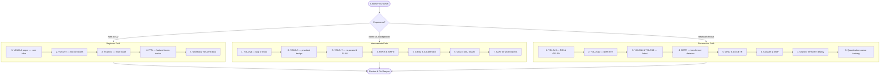

# Recommended Reading Order

```mermaid
flowchart TD
    Start([Choose Your Level]) --> B{Experience?}

    B -->|New to CV| Beginner
    B -->|Some DL Background| Intermediate
    B -->|Research Focus| Researcher

    subgraph Beginner [Beginner Path]
        B1["1. YOLOv1 paper — core idea"]
        B2["2. YOLOv2 — anchor boxes"]
        B3["3. YOLOv3 — multi-scale"]
        B4["4. FPN — feature fusion basics"]
        B5["5. Ultralytics YOLOv8 docs"]
        B1 --> B2 --> B3 --> B4 --> B5
    end

    subgraph Intermediate [Intermediate Path]
        I1["1. YOLOv4 — bag of tricks"]
        I2["2. YOLOv5 — practical design"]
        I3["3. YOLOv7 — re-param & ELAN"]
        I4["4. PANet & BiFPN"]
        I5["5. CBAM & CA attention"]
        I6["6. CIoU / SIoU losses"]
        I7["7. SAHI for small objects"]
        I1 --> I2 --> I3 --> I4 --> I5 --> I6 --> I7
    end

    subgraph Researcher [Researcher Path]
        R1["1. YOLOv9 — PGI & GELAN"]
        R2["2. YOLOv10 — NMS-free"]
        R3["3. YOLO11 & YOLO12 — latest"]
        R4["4. DETR — transformer detector"]
        R5["5. DINO & Co-DETR"]
        R6["6. ClusDet & SNIP"]
        R7["7. ONNX / TensorRT deploy"]
        R8["8. Quantization-aware training"]
        R1 --> R2 --> R3 --> R4 --> R5 --> R6 --> R7 --> R8
    end

    Beginner --> Review([Review & Go Deeper])
    Intermediate --> Review
    Researcher --> Review
```
