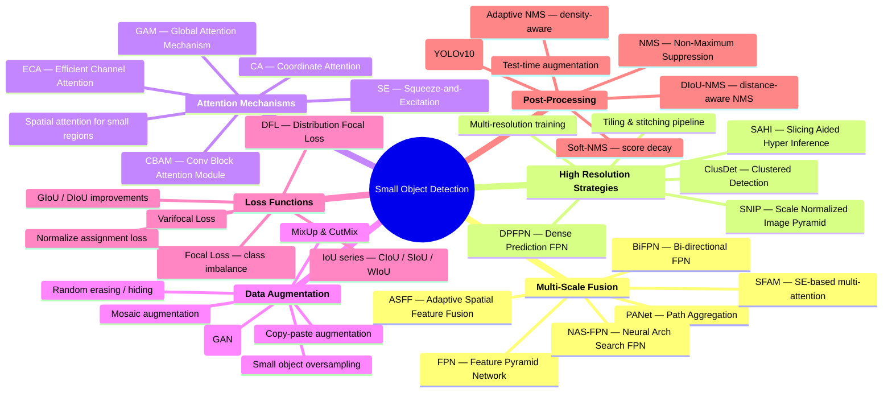

# Small Object Detection: Technique Taxonomy

```mermaid
mindmap
  root((Small Object Detection))
    **Multi-Scale Fusion**
      FPN — Feature Pyramid Network
      PANet — Path Aggregation
      BiFPN — Bi-directional FPN
      NAS-FPN — Neural Arch Search FPN
      ASFF — Adaptive Spatial Feature Fusion
      SFAM — SE-based multi-attention
    **High Resolution Strategies**
      SAHI — Slicing Aided Hyper Inference
      SNIP — Scale Normalized Image Pyramid
      ClusDet — Clustered Detection
      DPFPN — Dense Prediction FPN
      Tiling & stitching pipeline
      Multi-resolution training
    **Attention Mechanisms**
      SE — Squeeze-and-Excitation
      CBAM — Conv Block Attention Module
      CA — Coordinate Attention
      ECA — Efficient Channel Attention
      GAM — Global Attention Mechanism
      Spatial attention for small regions
    **Data Augmentation**
      Mosaic augmentation
      Copy-paste augmentation
      MixUp & CutMix
      Small object oversampling
      Random erasing / hiding
      Generative augmentation (GAN)
    **Loss Functions**
      Focal Loss — class imbalance
      IoU series — CIoU / SIoU / WIoU
      DFL — Distribution Focal Loss
      Varifocal Loss
      Normalize assignment loss
      GIoU / DIoU improvements
    **Post-Processing**
      NMS — Non-Maximum Suppression
      Soft-NMS — score decay
      DIoU-NMS — distance-aware NMS
      Adaptive NMS — density-aware
      NMS-free (YOLOv10)
      Test-time augmentation
```
